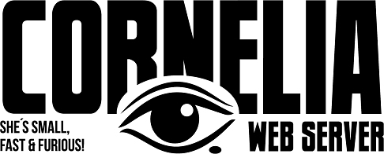

 

******************************************************
*  Welcome to Cornelia Web Sever                     *
*  CrazedoutSoft 2022 by Fredrik Roos.               *
*  http://crazedout.com/corny/ info@crazedout.com    *
*  https://github.com/openssl                        *
******************************************************

goto cornelia install directory.

set env CORNELIA_HOME to where cornelia_d is located.
(export CORNELIA_HOME=<path to cornelia>)

run make
run bin/startup.sh (may have to chmod 755 on *.sh files in /bin)

If lib errors appears in make process or runtime you may have to copy: 
 openssl/libcrypto.so, openssl/libcrypto.so.3, openssl/libssl.so and openssl/libssl.so.3 
to /usr/lib

test if you have php-cgi installed
./php-cgi

otherwise download and install php-cgi lie so:
sudo apt install php
sudo apt install php-cgi

OpenSSL:
If you can't build Cornelia with the OpenSSL headers and libs provided you 
must compile your own OpenSLL libs and replace them in dir openssl
https://github.com/openssl

jGazm:
 1) Java JDK 1.7 or above must be installed. Some JRE's may work but no guarantee.
 2) Run ./setup_linux (you may have to chmod 755 on "setup_linux")
 3) JAVA_HOME must be set to current JVM 1.7 (or above) in file jgazm. Setup script will try to get it right but may fail.

 Good Luck / Fredrik. 
