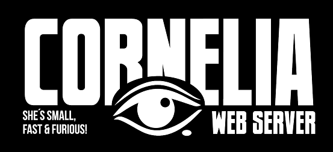

 

******************************************************
*  Welcome to Cornelia Web Server                    
*  CrazedoutSoft 2022 by Fredrik Roos.           
*  http://crazedout.com info@crazedout.com   
*  https://github.com/openssl                      
******************************************************

<b>Quick start:</b> 
><b>git clone https://github.com/CrazedoutSoft/cornelia.git</b> 
><b>cd cornelia</b> 
><b>./build_all no-ssl-no-warn</b>  [<i>no_ssl-no-warn</i> excludes problems with ssl/tls and compiler warnings] 
><b>export CORNELIA_HOME=[current_dir]</b> 
><b>bin/startup.sh</b> 
><b>Result in prompt:</b> 
><b>Cornelia listening on 8080 [HTTP]</b> 
><a href="http://localhost:8080">http://localhost:8080</a>
 
><a href="https://crazedout.com/corny.mp4">Installation video</a>

<b>RECOMMENDED: FULL INSTRUCTIONS:</b>

goto cornelia install directory. 

set env CORNELIA_HOME to cornelia install dir.
(export CORNELIA_HOME=<path to cornelia>)

If you start bin/startup.sh from cornelia directory CORNELIA_HOME is set to pwd.

Default HTTP port is 8080, SSL 8081, TLS 8082. Edit this in conf/corny.conf

>make (or 'make no_ssl' for http only) 
>bin/startup.sh (may have to chmod 755 on *.sh files in /bin) starts http server. 
>bin/startup.sh http starts http server only. 
>bin/startup.sh ssl starts ssl server only. 
>bin/startup.sh tls starts tls server only. 
>bin/startup.sh all starts http,ssl and tls server. 

The same applies to bin/shutdown.

If you want to be able to start Cornelia without the <i>bin/startup.sh</i> script 
and the openssl libs are not in /usr/lib, then LD_LIBRARY_PATH need to be set.

>export LD_LIBRARY_PATH=$CORNELIA_HOME/openssl

If lib errors appears in make process or runtime you may have to copy:  
 openssl/libcrypto.so, openssl/libcrypto.so.3, openssl/libssl.so and openssl/libssl.so.3  
to /usr/lib

test if you have php-cgi installed 
>which php-cgi

otherwise download and install php-cgi like so (Ubuntu): 

>sudo apt install php 
>sudo apt install php-cgi

Root directory by default is set to $CORNELIA_HOME/www. In "www" there are a numbers of test files for various stuff. 
Delete these files at your own discretion. Please leave "www/res" as the icons for dir listing resides there - by default.  
If you change the root directory, Cornelia will still look for these icons in /res so a sym link or actual move is recommended.

<b>Warning: Since Cornelias primary purpose is for development the header 'Access-Control-Allow-Origin' is set to '*' by default. 
This is dangerous in a open context. Change this in conf/Access-Control-Allow.txt

For the http <i>OPTIONS</i> request the response is set in conf/http_options.
</b>

<b>User enpoints</b> 
Set up virtual endpoints: 
In conf/corny: 
[virtual_files] 
#endpoint path file 
/myendpoint / my_repsponse_file.pl 
[virtual_files]

><b>Set up custum endpoints on cmd line:</b> 
>bin/cornelia_d -uep:/myendpoint%file:myjson.js%application/json 
>bin/cornelia_d -uep:/myendpoint%{"my","answer"}%application/json 
>If <i>Content-Type</i> is omitted - application/json is default. 
><b>http://localhost:8080/myendpoint</b> will respond with supplied response (or from file) with <i>Content-Type</i> or application/json if omitted.

OpenSSL: 
If you can't build Cornelia with the OpenSSL headers and libs provided you  
must compile your own OpenSLL libs and replace them in dir openssl 
https://github.com/openssl

<b> ! You should of course replace the default cert/keys with your own using cert/make_ssl_cert and/or cert/make_tls_cert !</b>

Cornelia handles all default CGI such as plain c binaries, shell script, perl and so on. 
PHP is handled by php-cgi and *.jgazm by jGazm. 
Cornelia also includes a home brewed simple version of JSP <a href="JSPZ.md">JSPZ.md</a>.

jGazm: 
 1) Java JDK 1.7 or above must be installed. Some JRE's may work but no guarantee. 
 2) Run ./setup_linux (you may have to chmod 755 on "setup_linux")

 3) For 'Online jGazm' to work $CORNELIA_HOME/jgazm needs to be in PATH.

>cd jgazm 
>./setup_linux

 3) JAVA_HOME must be set to current JVM 1.7 (or above) in file jgazm. Setup script will try to get it right but may fail.

 Good Luck / Fredrik. 
